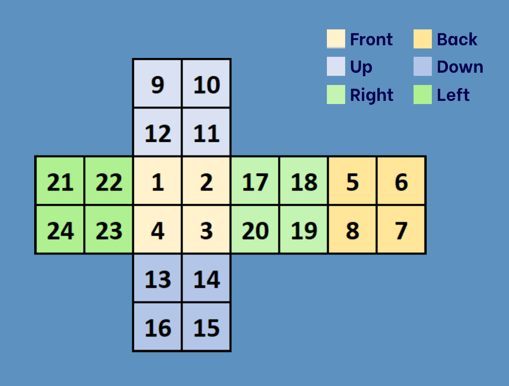

# rubiks-cube-solver

Clockwise: 
f=front  
b=back  
u=up  
d=down  
r=right  
l=left 
 
Counterclockwise: 
f'=front  
b'=back  
u'=up  
d'=down  
r'=right  
l'=left 
 
Color: 
w=white  
y=yellow  
b=blue  
g=green  
o=orange 
r=red 
